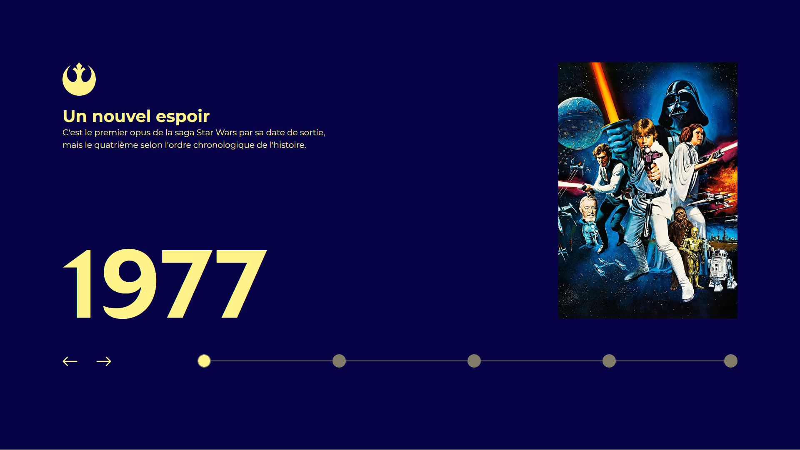
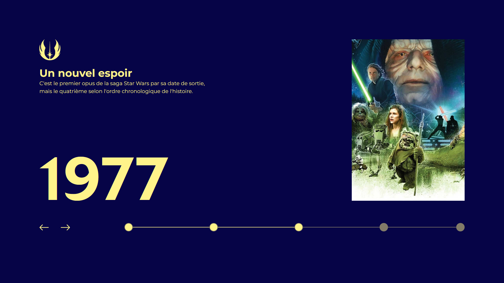

# UI Star Wars

## Table of Contents
- [UI Star Wars](#ui-star-wars)
  - [Table of Contents](#table-of-contents)
  - [General Information](#general-information)
  - [Technologies Used](#technologies-used)
  - [Screenshots](#screenshots)
  - [Project Status](#project-status)
  - [Room for Improvement](#room-for-improvement)
  - [Acknowledgements](#acknowledgements)
  - [Contact](#contact)

## General Information
- The goal of this project was to reproduce a User Interface from a [Figma file](https://www.figma.com/proto/xaisLkNZJvZXq6Ca8qO6El/UI_StarWars?node-id=172%3A291&scaling=min-zoom&page-id=0%3A1&starting-point-node-id=172%3A243) as fast as possible
- This UI had been provided in a [Benjamin Code's video](https://youtu.be/Ld97MuYMaQQ) in early 2022
- I undertook this project because the challenge particularly tempted me and I wanted to improve my integration skills

## Technologies Used
- [SCSS](https://sass-lang.com/)
- [JS](https://www.javascript.com/)
- HTML

## Screenshots

## Project Status
Project is: _in progress_.

## Room for Improvement

Room for improvement:
- Better code quality (Rename, smallest functions...)

To do:
- Switch date and text like poster when click on arrow
- Implement visual effect of switching (slide)

## Acknowledgements
- This project was based on a [@bdebon](https://github.com/bdebon) challenge.
- Many thanks to him for this wonderful project I enjoyed doing

## Contact
Developed by [@alextison](https://github.com/alextison) - feel free to contact me!